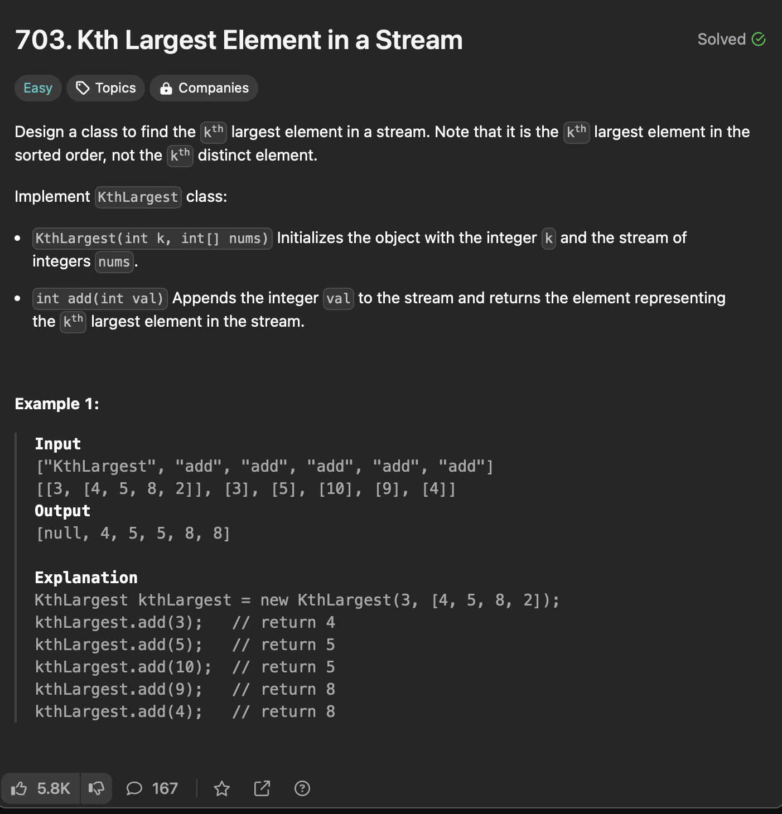

class KthLargest {
public:
    
    priority_queue<int , vector<int>,greater<int>>pq;
    int gk;
    KthLargest(int k, vector<int>& nums) {
        gk = k;
        for(auto x: nums){
            pq.push(x);
            if(pq.size()>k){
                pq.pop();
            }
        }
        
    }
    
    int add(int val) {
        pq.push(val);
        if(pq.size()>gk){
            pq.pop();
        }
        return pq.top();
        
    }
};

